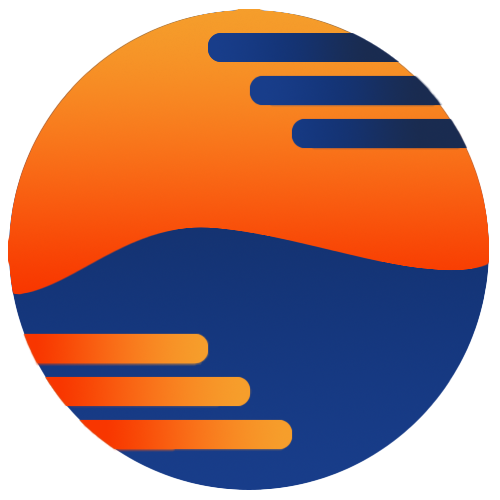

    
    <h1>Celsira</h1>
    
The first open source platform to digitalize private beach experiences for owners, employees and beachgoers.

---

Celsira is revolutionizing the way private beaches operate and interact with their guests. By digitalizing the
management and reservation processes, Celsira provides an all-in-one solution for beach owners, while also enhancing the
customer experience for beachgoers. Celsima, the management tool within Celsira, empowers beach owners and their
employees to efficiently manage operations, from deck chair reservations, to customer analytics, reservations and payments.

# Table of Contents

1. [Features](#features)
2. [Contributing](#contributing)
3. [License](#license)
4. [Credits](#credits)

# Features

With the first version to come of Celsira and Celsima, you can:

- **Digital Beach Management**: Manage your beach’s operations seamlessly through an intuitive web and mobile platform.
- **Beachmap System**: Visualize your beach layout and manage deck chair reservations with ease.
- **Customer Analytics**: Gain insights into guest preferences and behaviors to improve service offerings.
- **Employee Management**: Simplify staff management with role-based access and task delegation.

# Contributing

We welcome contributions from the community! While the core functionality of Celsira and Celsima remains proprietary to
ensure the integrity and quality of our platform, we are committed to open-sourcing certain components to foster
community collaboration. If you're interested in contributing, please make sure to read and follow
our [Contributing Guidelines](../CONTRIBUTING.md), [Code of Conduct](../CODE_OF_CONDUCT.md),
and [Developer Certificate of Origin](../DCO.md).

# License

This repository (`.github`) is licensed under the [MIT License](../LICENSE). Most of the core features of Celsira and Celsima are
proprietary, use different licenses and remain private to maintain our business integrity. However, we are actively working to open-source
select components, such as language translations, UI components, and APIs, to encourage community contributions and
improvements.

By contributing to public Celsira/Celsima and other related platforms, you agree that your contributions will be released under the mentioned license in the repository.
Additionally, you agree to adhere to the [Contributor Covenant Code of Conduct](.github/CODE_OF_CONDUCT.md)
and [Developer Certificate of Origin](.github/DCO.md).

# Credits

## Special Thanks

Celsira would not have been possible without the incredible tools and frameworks developed by the open-source community.
We would like to extend a special thank you to:

- **React Native**: For enabling the development of a cross-platform mobile experience.
- **Angular**: For providing a powerful framework to build our web platforms.
- **NestJS**: For providing a robust framework to power our backend services.
- **MongoDB**: For delivering a scalable and flexible database solution that supports our platform’s growth.

Released by [@danieljancar](https://github.com/danieljancar) and [@cyrilkurmann](https://github.com/Gr1ll)
